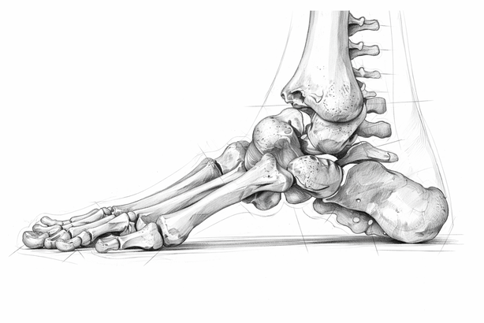

# Участие на стъпалото в ходенето

Това е част от поредицата „Малки крачки към по-здравословно ходене” от рубриката [„Живот
в движение”](index.md).

!!! info "Маринела Сидерова Димитрова"

	Съветите, които ще получите тук не са свързани с научни изследвания, а с моя личен опит
	на кинезитерапевт, знания придобити от пет годишно обучение в НСА „Васил Левски” и
	Медицински колеж „Йорданка Филаретова”, няколко курса през годините, 12 години
	анализиращ практически опит в МБАЛСМ „Н. И. Пирогов” и 18 години в моя кабинет.

## Опората на нашето тяло

Стъпалото е изградено от множество малки и по-големи кости, свързани помежду си чрез
стави и връзки стабилизиращи ставите. Начина на разположение на костите, ставите и
мускулите, които ги поддържат оформя двата свода на стъпалото: надлъжен свод (арката по
дължина на стъпалото) и напречен свод (извивката в основата на пръстите напречно
разположена от палеца към малкия пръст). Това е една сложна биоконструкция, осигуряваща
мобилна стабилност в опората на нашето тяло. Двата свода, когато те са добре развити, са
конструкция, която омекотява стреса генериран от контакта на тялото с опората при
ходене, тичане, танц, скокове и други двигателни активности.

Тези сводове се развиват в нашия растеж с различна изразеност и ефективност. Те се
поддържат освен от костно-ставната анатомична структура, също от мускулатурата, която
движи стъпалото заедно с неговите пръсти. Колкото по-динамичен е човек, толкова по-добре
развити сводове притежава. Разбира се съществува генетичен фактор, обуславящ слабост на
сводовете, което може да бъде компенсирано от подходяща физическа активност.

## Босото ходене

Важно условие за изграждане на сводовете е босото ходене. Малките деца обичат да ходят
боси, добре е да поощряваме това, когато има подходящи условия. Ходенето бос по релефни
повърхности тренира мускулатурата, която изгражда сводовете и ги укрепва. Когато
ползваме обувки добър избор са босите обувки. Те са с изключително меки подметки, които
позволяват на стъпалото да усеща релефа на повърхностите и да тренира своите сводове.
Босите обувки имат широка предна част, позволяваща адекватно участие на пръстите в
ходенето.

## Участието на пръстите

А участието на пръстите в ходенето е ключов момент в изграждането и съхранението на
сводовете, особено напречния свод. За жалост така наречените “класически обувки” не
притежават достатъчно място за добра опора на пръстите и поради тази причина над 50% от
хората са със спаднал напречен свод. Да не говорим за острите обувки на висок ток &mdash;
катастрофа за стъпалото!

Голяма част от хората не използват пръстите си при ходенето до степен те да стоят във
въздуха, свити и неефективни. Резултат от това са разместени стави, образуване на
болезнени мазоли, деформация на кости, възпаления и болезненост в областта на стъпалото,
което създава нарушения в цялата кинетична верига &mdash; глезен, коляно, тазобедрена става,
гръбначен стълб, череп.

## Правилна постановка на ходене

  <iframe width="250" height="445"
          src="https://youtube.com/embed/1EOvWT1PkSE"
          title="Правилна постановка на ходене"
          frameborder="0"
		  allow="accelerometer; autoplay; clipboard-write; encrypted-media; gyroscope; picture-in-picture; web-share"
          allowfullscreen>
  </iframe>

При ходенето стъпалото започва своя контакт с повърхността чрез петната кост. Правилно е
да стъпите в нейната средна част (нито отвън, нито отвътре). Опората продължава по
външния ръб на ходилото до поемането на тежестта на тялото от предното ходило, където тя
трябва да се разпредели в основата на малкия пръст и основата на палеца (при изразен
напречен свод) и да се предаде към пръстите. Във фазата на оттласкването, когато другият
крак започва да поема опора с пета, е необходимо пръстите да натиснат с цялата си долна
повърхност и да засилят потенциала на стъпалото.

Желателно е да поставите стъпалото при стъпването не точно в посоката на движение, а
малко (от 5 до 15 градуса) навън. Това правило има изключения при засилена ротация на
подбедрицата. Ако стъпалото ви стъпва с по-голям ъгъл на отвеждане навън е необходимо да
уточните от къде произхожда проблема. Бихте могли да направите консултация с ортопед или
кинезитерапевт, физиотерапевт, остеопат.

Ако вашите пръсти са свити и не могат да осъществят плътен контакт с пода, знайте, че
бихте могли да ги изпънете чрез разтегляне на тяхната долна повърхност. Това разбира се
е свързано с болка, затова го направете постепенно, но настойчиво всеки ден докато
възстановите тяхната опора.

!!! tip ""
	
	Нашите стъпала са нашия фундамент! Грижете се добре за тях!
