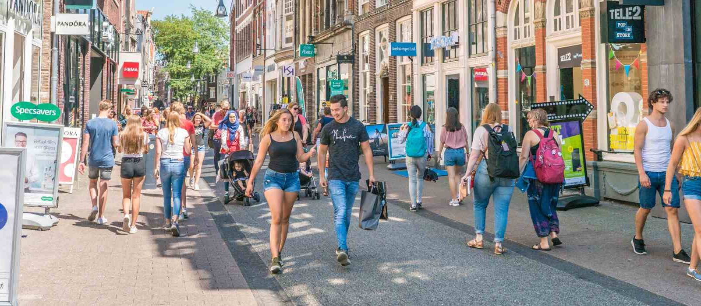

Това е част от поредицата „Ежедневни навици” от рубриката [„Живот в движение”](index.md).

!!! info "Татяна Тодорова Александрова ван Дайк"

# Ключът се крие не в интензивността, а в постоянството &mdash; уроци от Нидерландия

Във време, когато заседналият начин на живот се е превърнал в норма и физическата
неактивност е призната в световен мащаб за една от най-големите заплахи за общественото
здраве, е необходимо да се върнем към най-фундаменталната форма на човешко движение:
ходенето. Въпреки че съвременните общества често инвестират в интензивни спортни
програми и технологични решения за здравословни проблеми, стойността на ежедневната,
достъпна физическа активност остава недооценена.

Особено показателен пример в това отношение е Нидерландия – страна, в която активната
мобилност като ходене и колоездене е интегрирана в ежедневието и публичните политики.
Този контекст ни позволява да разгледаме ходенето не само като личен избор, но и като
обществен приоритет.

В този аргумент защитавам твърдението, че ходенето представлява съществен стълб както за
индивидуалното здраве, така и за обществената устойчивост и че тази дейност трябва да
бъде структурно насърчавана.

## Първи аргумент 

Ходенето видимо намалява здравните рискове, то е една от най-изследваните и доказано
ефективни форми на превантивно здравеопазване.

!!! tip "Ходене 30 минути дневно"

	**Факт**: Нидерландският национален институт за обществено здраве и околна среда (RIVM –
	[Rijksinstituut voor Volksgezondheid en Milieu](https://www.rivm.nl))
	ни информира[^RIVMHM2023], че ходенето в продължение на 30 минути дневно намалява риска от
	сърдечно-съдови заболявания с приблизително 20%.

Тези цифри показват, че ходенето не е просто допълнителна дейност, а **структурна
интервенция**, която може значително да намали натиска върху здравеопазването. Освен това,
ходенето е достъпно за почти всички възрастови групи, което го прави приобщаваща форма
на превенция.

## Втори аргумент 

В допълнение към физическите ползи, ходенето има дълбок ефект върху психичното здраве и
когнитивните функции.

!!! tip "Ходенето помага способността за концентрация"

	**Факт**: Изследвания на [Университета в Утрехт](https://www.uu.nl)
	показват, че ходенето води до значително намаляване на нивата на кортизол и подобряване
	на способността за концентрация.

Тези открития показват, че ходенето не само намалява стреса, но и допринася за
психическата устойчивост и производителността. В общество, където симптомите на
прегаряне се увеличават, този ефект е безценен.

## Трети аргумент 

Ходенето е устойчива и социално приобщаваща форма на мобилност. То не изисква финансови
инвестиции, технически умения и инфраструктура, достъпна само за определени групи.
Следователно, то е една от най-„демократичните” форми на упражнения. Освен това,
ходенето допринася за по-устойчива жизнена среда: всяка стъпка, която замества
пътуването с кола, намалява емисиите на CO₂ и задръстванията.

В градските райони, повече ходене води и до по-оживени, по-безопасни и социално свързани
квартали &mdash; ефект, ясно наблюдаем в градове в Нидерландия, където пешеходната
инфраструктура е приоритет.

## Критики

Критиците често твърдят, че ходенето не е достатъчно интензивно, за да донесе значителни
ползи за здравето. Те твърдят, че предимно интензивните форми на упражнения действително
имат ефект. Това разсъждение обаче е недостатъчно обосновано.

!!! tip "Редовните леки (до умерени) упражнения са много полезни"

	**Факт**: Световната здравна организация подчертава, че леките до умерени упражнения,
	при условие че се изпълняват редовно, носят сравними ползи за здравето с интензивния
	спорт.

Следователно ключът не се крие в интензивността, а в постоянството. Ходенето е ефективно
именно защото е устойчиво, дори за хора с физически ограничения или натоварен график.

## Заключение

Ходенето е проста, но мощна интервенция, която насърчава както индивидуалното здраве,
така и обществената устойчивост. То намалява риска от хронични заболявания, укрепва
психичното благополучие и допринася за приобщаващо и екологично общество. Следователно,
моето заключение е ясно: ходенето трябва да бъде утвърдено като основна ежедневна
практика, а не като нещо второстепенно. То заслужава структурно място в политиката,
образованието и личния начин на живот.

[^RIVMHM2023]: Източник: [RIVM, Health Monitor, 2023](https://rivm.openrepository.com/entities/publication/1b4e632e-bb0a-4eb2-8f4f-482ec72a7007).
