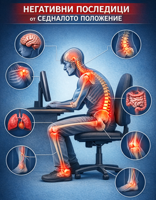

# Седящият човек

!!! info "Маринела Сидерова Димитрова"

	Това е част от рубриката [„Живот в движение”](index.md).

	<figure markdown="span">
		{ width="500" }
	</figure>

Човекът на нашето съвремие е често седнал. Той седи в офиса работейки на компютър,
пътува до офиса и обратно към дома седнал в автомобила и когато си почива от това
седене, пак седи – пред телевизора, четейки книга, хранейки се, общувайки в компания с
приятели.

Тази хиподинамия[^хиподинамия] има своите сериозни последици:

!!! note "Сгънати стави"

	Свитата позиция на краката обуславя мускулен дисбаланс &mdash; сгъвачите на коляното
	и тазобедрената става се скъсяват и започват да доминират, ограничавайки разгъването
	на тези стави в нашата изправена позиция. Този мускулен дисбаланс създава неправилни
	модели на ходене с лоша позиция на ставите, в която те бързо развиват артрози.
	Коляното не може да се разгъне докрай в опорната фаза на ходенето, поради скъсени
	мускули на прасеца и задното бедро, а също поради скъсяване на задните структури на
	ставата от нейното продължително свиване докато сме седнали. Тазобедрената става също
	не може да се разгъне достатъчно, когато крака остава зад тялото в края на опорната
	фаза, когато ходим. Това създава прекомерна компресия в предната част на ставата и
	развитие на коксартроза.

!!! note "Намалена функционалност на гръдния кош"

	Честото отпускане на позата поради умората на мускулите в седнало положение свива
	гръдния кош и ограничава дихателните движения, поради скъсяване на междуребрените
	мускули и гръдния мускул. Това намалява нашия дихателен капацитет, което обуславя
	бърза умора и не добра поносимост към физическо натоварване. Намалената подвижност на
	гръдния кош затруднява пълноценното разгъване на белия дроб със създаване на
	хиповентилирани и слабо кръвоснабдени зони, уязвими на възпаление при вирусни
	инфекции. Сърдечната дейност също се затруднява поради повишено съпротивление в
	малкия кръг на кръвообръщението. Нарушените дихателни движения задържат кръв в
	долната част на тялото и отново затрудняват сърцето в помпената му функция и към
	големия кръг на кръвообрущението.

!!! note "Компресиран лумбален дял на гръбнака"

	Седящата позиция натоварва прекомерно лумбалния дял на гръбнака, особено при
	отпусната поза, което създава неравномерна компресия на междупрешленните дискове,
	водеща до тяхната по-бърза дегенерация с поява на дискови хернии. Дисковите хернии
	притискат и възпаляват нервни структури с понякога тежки последици като пареза на
	долните крайници и незадържане на урината. Прекаленото статично натоварване на
	лумбалния гръбнак създава компресия и на носещите прешлени, които образуват остеофити
	(шипове) поради силния механичен стрес. Остеофитите от своя страна ограничават
	подвижността, дразнят меките тъкани и също могат да притискат нервни структури.

!!! note "Хипермобилна лопатка"

	Нарушен двигателен модел на раменната става, поради отпускане на стабилизаторите на
	лопатката при свита позиция на гръбнака.

!!! note "Твърди и болезнени мускули"

	Статичното натоварване на гръбната мускулатура я сковава в нейната продължителна
	изометрична контракция (мускула е непрекъснато в контракция без фаза на отпускане). В
	мускула трудно навлиза кръв, което нарушава неговия метаболизъм и задържа химични
	вещества като млечна киселина например. Това освен, че ограничава подвижността на
	гръбнака води до възпаления с честа болезненост в мускулите. Те стават дехидратирани,
	твърди, с намалена контрактилност и еластичност.

!!! note "Застой на кръвта в долните крайници"

	Застоя на кръвта в долните крайници е гравитационно обусловена. Липсва мускулната
	помпа, която тласка венозната кръв към сърцето, когато сме в движение. Вените
	набъбват и създават съпротивление за артериалната кръв, която храни тъканите. Това
	съпротивление затруднява и сърдечната дейност в усилията ѝ да доставя кръв на
	тъканите. Венозния застой обуславя и лимфен застой и краката започват да отичат все
	повече, година след година. Появяват се разширени вени, кожата става атрофична до
	степен на образуване на рани.

!!! note "Нарушено храносмилане"

	Отпуснатата поза в седнало положение поради умора на мускулите притиска стомаха и
	нарушава неговото кръвообръщение. Това намалява неговата възможност за пълноценно
	разграждане на храната. Заедно с това намаленото пространство в горната коремна кухина
	тласка коремните органи надолу към таза. Това смъкване на коремни органи затруднява
	тяхната функция. Абсорбцията на хранителни вещества от тънките и дебелото черво е
	непълноценна.

!!! note "Нарушено хранене на мозъка"

	Лоша позиция на шийния дял на гръбнака при отпускане на позата с притискане на
	вертебралната артерия и нарушено кръвоснабдяване на мозъка. Последици: главоболие,
	нарушена концентрация, световъртеж, болки в мускулите поддържащи главата.

!!! note "Доминация на симпатикус"

	Сковаването на гръбнака започва да дразни симпатиковите ганглии (дял от Вегетативната
	нервна система), намиращи се в гръдния дял покрай гръбнаяния стълб. Това обуславя
	доминация на симпатикуса с последици като: напрегнатост, ускорен пулс (тахикардия),
	повишено кръвно налягане, забавена перисталтика и нарушено храносмилане, подтисната
	полова функция ...
	
!!! note "Затлъстяване"

	Забавен метаболизъм с всички последици от това, най-съществен от които е затлъстяването.

За съжаление, в повечето случаи се опитваме да се справим с последствията от седящата
позиция, а не с първопричината. Промяната на навиците е сериозно предизвикателство и
началото винаги е трудно. Добрата новина е, че дори малки промени могат да доведат до
забележими резултати &mdash; а те водят до мотивация, която от своя страна води до още
успехи, и така кръгът се затваря. Например, една непринудена разходка по 5 минути на час
през работния ден (под всякакъв претекст) може да окаже позитивно влияние не само върху
мускулите и ставите ви, но ще ви помогне да бъдете по-концентрирани и продуктивни.
Комбинирано с поне 30 минутна разходка (например с колеги след като се наобядвате),
поставя основата на значима промяна (промяна, която мотивира).

Няма магически решения, всеки трябва да намери какво работи за него като се интересува и
експериментира (тук няма алтернатива). Необходима ни е работа за мобилност на ставите,
сила на мускулатурата, дихателна гимнастика, кардио натоварване ... Едно от
най-комплексните упражнения (царят на движението) е ходенето! Човекът е създаден да се
движи &mdash; да ходи, да танцувай, да прави гимнастка. 

Нека се докоснем до земята, и да допуснем позитивна промяна в живота си!

[^хиподинамия]: Намалена двигателна активност.
