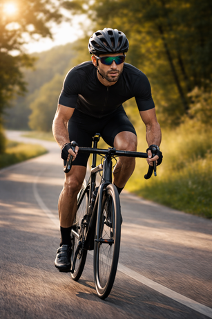
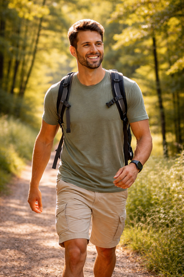

# Колоездене или ходене

!!! info "Маринела Сидерова Димитрова"

	Това е част от рубриката [„Живот в движение”](index.md).

Човекът в своята еволюция и технологичен прогрес е създал множество улеснения, които
наред с предимствата, които са ни донесли, имат и своите недостатъци. Велосипедът е едно
от тези „улеснения”. Не бих могла да отрека и ползата от него, но вредното му
въздействие, близко до вредите от седналата позиция, надминава ползите. Признавам,
карането на велосипед е едно положително емоционално преживяване и възможност за
споделяне на тази емоция. Хората, чието ежедневие е динамично не биха имали проблем ако
ползват велосипед понякога. Не мога да кажа това за хората, които работят седнали. Те
имат нужда да се изправят.

## Колоезденето

<figure markdown="span">

</figure>

Нека разгледаме позицията на човешкото тяло върху велосипеда:

+ опора върху седалищните кости
+ наклон на тялото напред
+ свит гръбначен стълб
+ неподвижна опора на ръцете
+ шийният дял е в постоянно разгъната позиция и изнесена напред глава
+ свити тазобедрени стави
+ свити коленни стави
+ непълноценна опора на стъпалата

Опора върху седалищните кости &mdash; те не са създадени да омекотяват гравитационния
стрес, както това правят коляното и стъпалото.

Наклон на тялото напред &mdash; създава компресия в тазобедрените стави при голям ъгъл
на сгъване. Това е една от предпоставките за развитие на коксартроза.

Свит гръбначен стълб &mdash; гръбначния стълб е неподвижен в неговата свита позиция,
което притиска междупрешленните дискове в тяхната предна част. По този начин течността,
която храни дисковете се изтласква в тяхната задна част. Назад се изтласква и ядрото на
диска. Това често е причина за поява на дискови хернии. Статичната позиция на гръбнака,
нарушава храненето на неговите структури, което е предпоставка за по-бърза дегенерация.

Неподвижна опора на ръцете &mdash; статични ръце. Липсата на динамика в ръцете лишава
ставите им от активна продукция на синовиална течност, а тя е тази, която ги храни.
Лопатката е изнесена напред поради сгънатия гръбнак. Това разтегля мускулите, които я
стабилизират към гръбначния стълб и тя започва прекалено много да участва в движенията
на ръката, за сметка на подвижността на раменната става. Така се нарушава здравословната
съгласуваност в движенията на лопатката и раменната става, което води до най-честия
проблем в раменната става &mdash; Синдром на притискане на околоставните тъкани.

Шийния дял е в постоянна разгъната позиция с изнасяне на главата напред. В тази позиция
главата е много по-тежка. Мускулатурата, която я поддържа се напряга прекомерно и се
втвърдява, което създава мускулен дисбаланс в областта. Натоварването върху структурите
на шийния и горния торакален (гръден) дял на гръбначния стълб също е неправилен.
Статичното натоварване на гръбнака в неговата неправилна (нефизиологична) позиция води
до по-бърза дегенерация на структурите му.

Тазобедрените стави се движат само по посока на сгъване. Това е една от причините за
поява на коксартроза (дегенерация на тазобедрената става). Движение към разгъване тук
липсва, а то е изключително необходимо за здравето на тазобедрената става.

Колянната става се движи предимно в градусите на сгъване. Пълно разгъване на коляното
липсва. Единственото предимство е, че коляното се движи в неговата отбременена позиция,
т.е. то не носи тежестта на тялото. Движението на коляното чрез велосипед стимулира
неговото хранене чрез отделяне на синовиална течност (qтечността, която храни ставните
структури), но не решава проблема с неговото крайно разгъване. Крайното разгъване на
коляното е изключително необходимо при ходенето, защото неговата опорна повърхност в
тази позиция е по-голяма отколкото, когато то поема тежестта на тялото в леко свита
позиция, тоест с дефицит в разгъването. Износването на ставните повърхности е много
по-бързо при по-малка опорна площ. Много честа грешка е при възстановяване след травма
или операция на коляното да се препоръчва каране на колело. В този случай движенията на
коляното на велоергометър, както вече споменахме са предимно в градусите на сгъване.
Коленете след травма или операция обичайно имат ставен оток. Движението на велоергометър
поддържа отока, защото дразни прекомерно ставната капсула. Липсата на разгъване генерира
оточност също в предните околоставни тъкани и това допълнително ограничава разгъването и
съответно правилното възстановяване на коляното като опорна става. Голяма част от хората
имат дефицит в крайното разгъване на ставата &mdash; последица от седналото положение
при работа, обучение и други дейности. Нека не допълваме този дефицит ползвайки колело.

Непълноценна опора на стъпалата &mdash; стъпалото има нужда да поеме опората
последователно с всички свои компоненти, което върху педалите е невъзможно.

В нашето ежедневие има прекалено много дейности, в които гръбначния стълб е статичен и
това е една от причините за неговата бърза дегенерация. Колоезденето ограничава
подвижността на най-трудно подвижната му част &mdash; гръдната. Там прешлените са
свързани с ребрата в изграждането на гръдния кош и грижата за движението им изисква
динамика в областта, което не можем да постигнем карайки велосипед.

Все пак колоезденето има и някои ползи:

+ отделяне на синовиална течност в ставите на долните крайници
+ засилване на мускулатурата на долните крайници
+ подобрява венозния отток от краката, но не толкова ефективно както е при ходенето
+ тренира кардио-респираторната система
+ по-бързо придвижване в сравнение с ходенето
+ положително емоционално въздействие

## Ходенето

<figure markdown="span">

</figure>

Ако тялото имаше възможност да изразява комфорта си с музика, ходенето щеше да бъде
най-прекрасната мелодия. Всяка става допълва прекрасно движението в съседните и се
създава ритъм на изграждащо движение.

Двигателни компоненти на ходенето:

+ редуващо се сгъване и разгъване на глезен, коляно, тазобедрена става
+ леки ротаторни движения в глезен, коляно и тазобедрена става
+ непрекъсната активност на мускулите поддържащи сводовете на стъпалото, особено чрез
ползване на боси обувки или ходене бос
+ ефективно трениране на седалищния мускул &mdash; основен стабилизатор на тазобедрената
  става
+ финни ротаторни движения на гръбначния стълб в неговата физиологично правилна позиция
+ махови движения в лакетна и раменна става, които хранят техните структури и намаляват
напрежението в мускулатурата им, която се натоварва в дейностите от ежедневието
+ леки аксиални (по оста на костта) сътресения върху костите, които стимулират
изграждане на здрави костни клетки
+ трениране на равновесие и осъвършенстване на нервно-мускулната проприорецепция
+ уравновесяване на двата дяла на вегетативната нервна система &mdash; симпатикус и
парасимпатикус
+ емоционално общуване с околната среда

Редуващо се сгъване и разгъване на коляно, глезен и тазобедрена става &mdash; това
освен, че създава компресия по цялата повърхност на описаните стави, включва всички
мускули около тях в тяхната редуваща се антагонистична контракция. Това означава, че
когато едните мускули действат, техните антагонисти (противодействащи) се отпускат. По
този начин мускулите се хранят ефективно с кръв, защото имат фаза на отпускане и фаза на
контракция. Важно е също това, че мускулатурата има ефективна контракция в своята
скъсена и в своята удължена позиция, което осигурява гъвкавост и пълноценна
контрактилност.

Непрекъсната активност на мускулите поддържащи сводовете на стъпалото &mdash; ходенето
по неравен терен е много полезно за сводовете на стъпалата и за трениране на мускулите,
които ги поддържат. Когато сте с обувки, добър избор са босите обувки, те позволяват
усещането на всяка неравност по терена и добра реактивност на сводовете.

Финни ротаторни движения на гръбначния стълб в неговата физиологично правилна позиция
&mdash; това се случва чрез разнопосочни движения на таза и раменния пояс. Тези ротации
хранят много добре междупрешленните стави и дискове. Мускулатурата на гърба също е в
динамика и подобрено хранене осигуряващо гъвкавост.

Маховите движения в раменна и лакетна става също подобряват тяхното хранене и релаксират
мускулите около тях. Маховите движения водят също до една обща релаксация на организма и
до усещане на волност и динамика. Свободното махово движение редува по много фин начин
последователна контракция на мускулите антагонисти и тяхното пълноценно захранване с
кръв.

Леки аксиални сътресения върху костите &mdash; редуването на опора на единия и другия
крак създава гравитационен стрес по остта на костите. Това е много добра стимулация на
образуване на костните клетки и профилактика на остеопорозата. Тези сътресения са
приложени към една биомеханично добре построена структура каквато е нашата изправена
позиция.

Ходенето е най-естественият треньор на нашата проприорецепция &mdash; импулсите от
мускулите, сухожилията и ставите, които достигат до мозъка чрез нервните влакна.
Проприоцептивния сетивен апарат ни дава възможност да усещаме позицията на двигателните
компоненти на тялото ни в пространството без да ги следим с поглед. Малките или
по-големи неравности на терена предизвикват колебания в опорно- двигателния ни апарат,
които по тази нервно-мускулна проводимост, достигат до Централната нервна система и
Вестибуларния апарат и водят до постепенно усъвършенстване на равновесието и баланса на
тялото ни.

Ходенето уравновесява Вегетативната нервна система (ВНС), която регулира автоматични
функции като сърдечен ритъм, дишане и храносмилане. Ритмичните и спокойни движения при
ходенето активират парасимпатикуса (този дял на ВНС, който успокоява тялото ни). Тогава
се потиска симпатикуса (дял на ВНС, който е активен при стрес и бойна готовност, при
високо интензивни движения). В дългосрочен план двата дяла се балансират, включването на
единия към другия става плавно и навреме.

Емоционално общуване с околната среда. Беше време когато аз се придвижвах с автомобил
навсякъде, където трябва да отида. Освен всички негативи на седналото положение, които
се стовариха върху мен разбрах, че пропускам важни неща по пътя си. Оказа се, че почти
не познавам града, в който живея, не забелязвах хората, сградите, дърветата, животните.
Сега ходя! И виждам всичко това, което обогатява моя свят, носи ми жизненост,
осъзнатост, информираност и запомняща се емоция.

И ако трябва да избирам между най-якото колело и ходенето не бих се колебала.

Моят избор е ХОДЕНЕТО!
