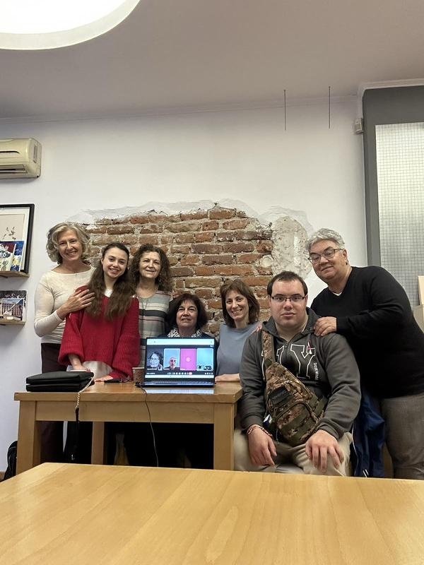

# Защо неправителствена организация

Пешачко е [Сдружение в Обществена
Полза](https://portal.registryagency.bg/CR/Reports/ActiveConditionTabResult?uic=208734044)
започнало във Фейсбук като [инициативата](https://www.facebook.com/share/1GZUcJEP3d)
„Ходи пеша, подари чист въздух на децата ни”. Но за да имаме конструктивна комуникация с
други подобни инициативи, и да сме активен участник в проектите на нашия град, е
необходимо да следваме стандартни правила, които осигуряват прозрачност и предвидимост.

Нашата цел е да бъдем отворени от самото начало. В
[GitHub](https://github.com/peshachko) можете да проследите както дискусиите за
регистриране на НПО, така и организацията и финансирането на всяко събитие. Нашето
[счетоводство](https://github.com/peshachko/accounting) също ще бъде достъпно за всеки
(ще сме щастливи да получим съвет и помощ в тази посока).

## Учредително събрание

На 1 Март 2026 в 17:00 се състоя нашето учредително събрание на адрес гр. София, НЧ
„Читалище.то” ул. Лавеле № 11 / ул. Лом № 1. Документи, които подписахме:

+ [устав.pdf](documents/устав.pdf)
+ [учредителен-протокол.pdf](documents/учредителен-протокол.pdf)

??? note "Учредители: 11"

	<figure markdown="span">
		
	</figure>

## Комуникации с институции

??? note "(20 Януари 2026) Дирекция Спорт и Младежки дейности към Столична община"

	Днес ПЕШАЧКО получи подкрепа от дирекция „Спорт и младежки дейности“ към Столична община.
	На среща с екипа на дирекцията представихме целите и идеите на сдружението, както и
	развитието ни досега. Бяхме приятно изненадани от милото отношение, ангажираността
	и предложеното съдействие. Скоро събитията на ПЕШАЧКО ще бъдат обявявани и от
	Столична община, както и от регионалните общини, на чиято територия се провеждат събитията.
	Получихме също съвети за възможности за финансиране, което би помогнало нашите идеи
	да достигнат до повече хора.
